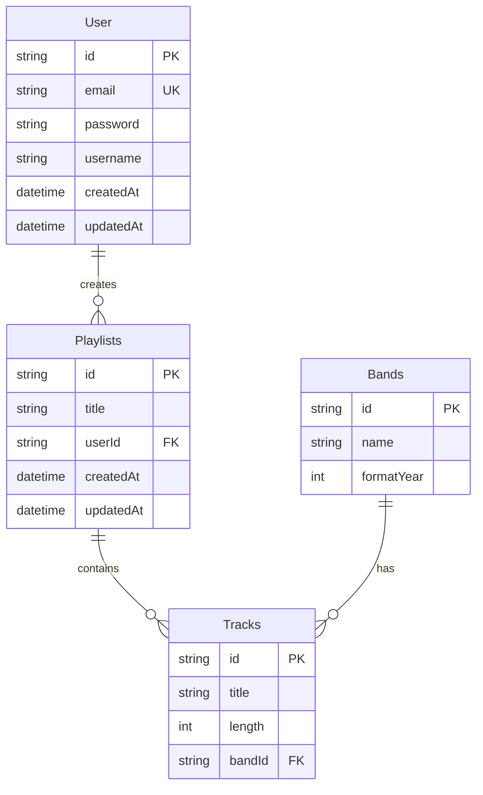

# 🎵 Music API REST

<p align="center">
  <a href="http://nestjs.com/" target="blank"></a>
</p>

Una API RESTful para gestión musical construida con NestJS, TypeScript y Prisma. Permite gestionar bandas, canciones, usuarios y listas de reproducción con autenticación JWT.

## 🚀 Características

- ✅ Autenticación de usuarios con JWT
- 🎸 Gestión completa de bandas y canciones
- 📝 Listas de reproducción personales
- 🔒 Rutas protegidas con autenticación
- 📚 Documentación automática con Swagger
- 🗄️ Base de datos SQLite con Prisma ORM

## 📋 Requisitos Previos

- Node.js (v18 o superior)
- npm o yarn

## 🛠️ Instalación

```bash
# Clonar el repositorio
git clone <repository-url>
cd Music_ApiREST

# Instalar dependencias
npm install
```

## ⚙️ Configuración

1. Crear archivo de variables de entorno:
```bash
cp .env.example .env
```

2. Configurar las variables en `.env`:
```env
DATABASE_URL="file:./dev.db"
JWT_SECRET="your-secret-key-here"
```

3. Generar Prisma client y migrar base de datos:
```bash
npx prisma generate
npx prisma db push
```

## 🏃‍♂️ Ejecutar el Proyecto

```bash
# Desarrollo (con recarga automática)
npm run start:dev

# Producción
npm run build
npm run start:prod
```

La API estará disponible en `http://localhost:3000`

## 📚 Documentación de la API

Una vez iniciado el servidor, accede a la documentación interactiva:
- **Swagger UI**: `http://localhost:3000/api`

## 🔐 Autenticación

La API utiliza JWT para autenticación. Las rutas protegidas requieren el header:

```
Authorization: Bearer <token>
```

### Flujo de Autenticación

1. **Registrar usuario**:
```bash
POST /auth/register
{
  "email": "user@example.com",
  "password": "password123"
}
```

2. **Iniciar sesión**:
```bash
POST /auth/login
{
  "email": "user@example.com", 
  "password": "password123"
}
```

3. **Usar el token** en rutas protegidas

## 🎵 Endpoints Principales

### Bandas
- `GET /bands` - Listar todas las bandas
- `GET /bands/:id` - Obtener banda por ID
- `POST /bands` - Crear nueva banda (requiere autenticación)
- `PUT /bands/:id` - Actualizar banda (requiere autenticación)
- `DELETE /bands/:id` - Eliminar banda (requiere autenticación)

### Canciones
- `GET /tracks` - Listar todas las canciones
- `GET /tracks/:id` - Obtener canción por ID
- `POST /tracks` - Crear nueva canción (requiere autenticación)
- `PUT /tracks/:id` - Actualizar canción (requiere autenticación)
- `DELETE /tracks/:id` - Eliminar canción (requiere autenticación)

### Usuarios
- `GET /users/profile` - Obtener perfil de usuario (requiere autenticación)
- `PUT /users/profile` - Actualizar perfil (requiere autenticación)

### Playlists
- `GET /playlists` - Listar playlists del usuario (requiere autenticación)
- `POST /playlists` - Crear nueva playlist (requiere autenticación)
- `GET /playlists/:id` - Obtener playlist por ID
- `PUT /playlists/:id` - Actualizar playlist (requiere autenticación)
- `DELETE /playlists/:id` - Eliminar playlist (requiere autenticación)
- `POST /playlists/:id/tracks` - Agregar canción a playlist (requiere autenticación)
- `DELETE /playlists/:id/tracks/:trackId` - Eliminar canción de playlist (requiere autenticación)

## 📊 Modelo de Datos



## 🧪 Ejecutar Tests

```bash
# Unit tests
npm run test

# E2E tests  
npm run test:e2e

# Coverage
npm run test:cov
```

## 🔧 Comandos Útiles

```bash
# Formatear código
npm run format

# Linter
npm run lint

# Build para producción
npm run build

# Resetear base de datos
npx prisma migrate reset
```

## 📁 Estructura del Proyecto

```
src/
├── bands/          # Módulo de gestión de bandas
├── tracks/         # Módulo de gestión de canciones
├── users/          # Módulo de autenticación y usuarios
├── playlists/      # Módulo de playlists
├── prisma/         # Servicio de base de datos
├── utils/          # Utilidades compartidas
├── app.module.ts   # Módulo principal
└── main.ts         # Punto de entrada
```

## 🤝 Contribuir

1. Fork el proyecto
2. Crear una rama (`git checkout -b feature/amazing-feature`)
3. Commit los cambios (`git commit -m 'Add amazing feature'`)
4. Push a la rama (`git push origin feature/amazing-feature`)
5. Abrir un Pull Request

## 📄 Licencia

Este proyecto está licenciado bajo la Licencia MIT.
